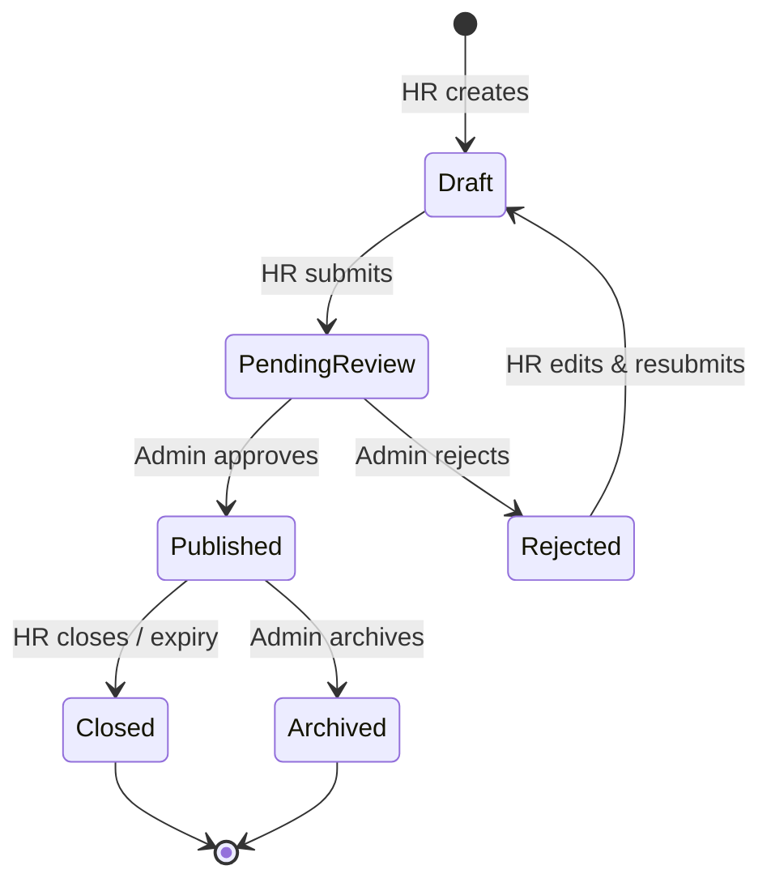
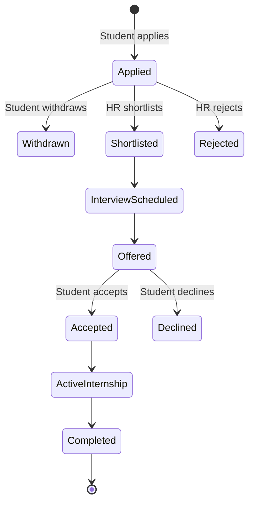
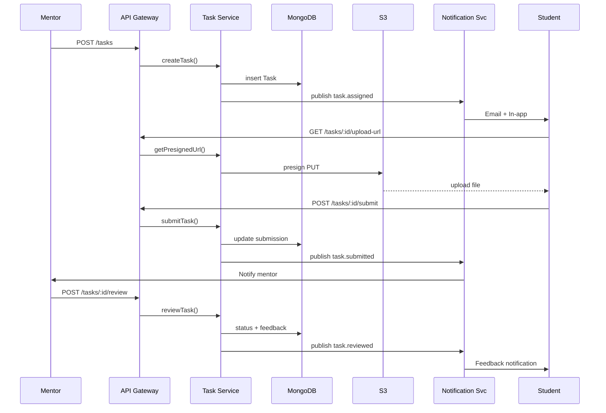
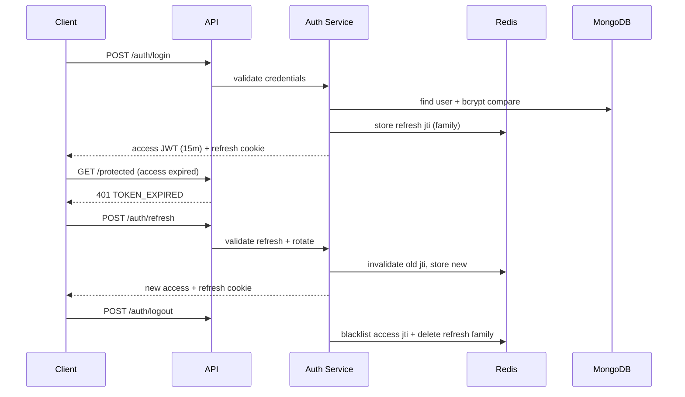
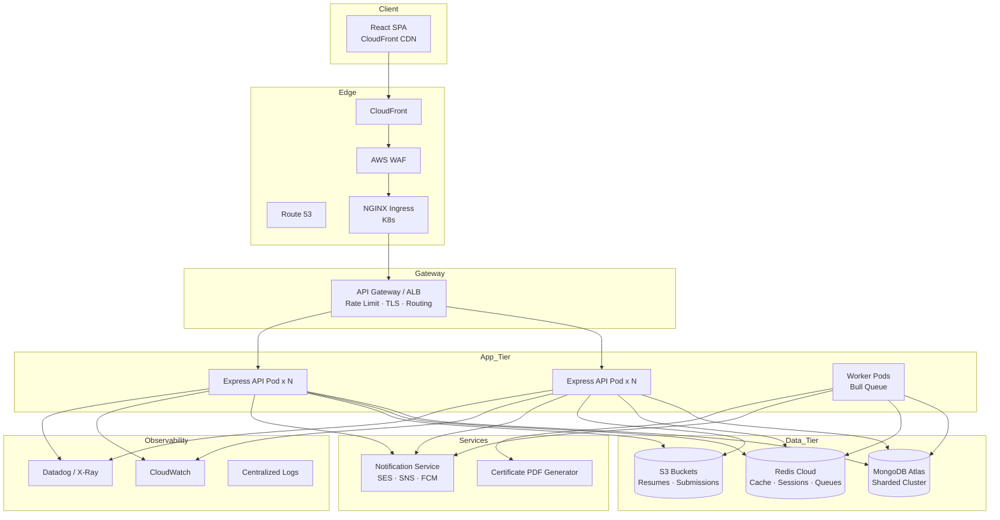
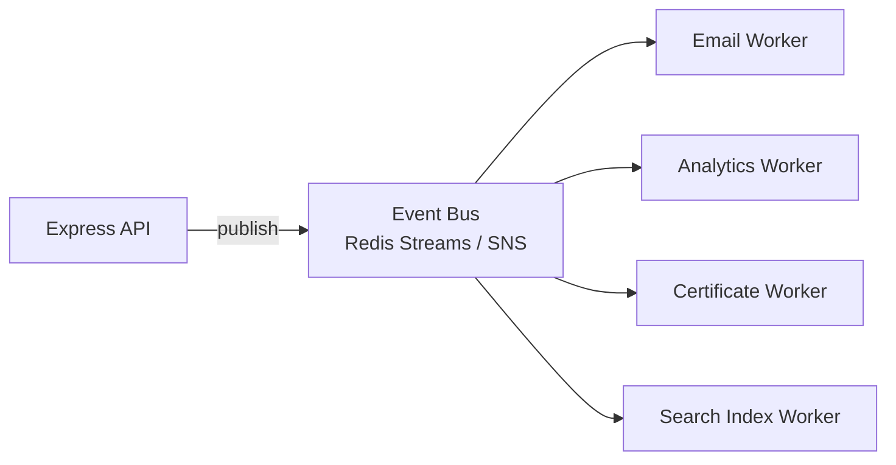
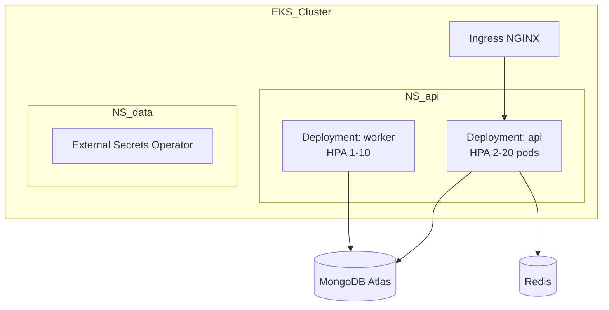

# System Design: Use Cases, Workflows, HLD, LLD

---

## 1. Use Case Diagram

```mermaid
graph TB
    subgraph Actors
        ST[Student]
        HR[Company HR]
        MN[Mentor]
        AD[Admin]
        SYS[External Systems]
    end

    subgraph Authentication
        UC1[Register / Login]
        UC2[OAuth / MFA]
        UC3[Password Reset]
    end

    subgraph Student_UseCases
        UC10[Manage Profile]
        UC11[Search Internships]
        UC12[Apply / Withdraw]
        UC13[Submit Tasks]
        UC14[View Evaluations]
    end

    subgraph Company_UseCases
        UC20[Manage Company Profile]
        UC21[Post Internship]
        UC22[Manage Applicants]
        UC23[Schedule Interview]
        UC24[Assign Mentor]
        UC25[Generate Certificate]
    end

    subgraph Mentor_UseCases
        UC30[View Interns]
        UC31[Assign Tasks]
        UC32[Review Submissions]
        UC33[Track Attendance]
    end

    subgraph Admin_UseCases
        UC40[Approve Company]
        UC41[Moderate Internship]
        UC42[User Management]
        UC43[Analytics]
        UC44[Platform Settings]
    end

    ST --> UC1 & UC10 & UC11 & UC12 & UC13 & UC14
    HR --> UC1 & UC20 & UC21 & UC22 & UC23 & UC24 & UC25
    MN --> UC1 & UC30 & UC31 & UC32 & UC33
    AD --> UC1 & UC40 & UC41 & UC42 & UC43 & UC44
    SYS --> UC2
```



---

## 2. Core Workflow Diagrams

### 2.1 Internship Approval Workflow



### 2.2 Application Lifecycle



### 2.3 Task Submission Flow



### 2.4 Authentication Token Flow



---

## 3. High-Level Architecture



### 3.1 Component Responsibilities

| Component | Responsibility |
|-----------|----------------|
| React SPA | UI, RTK Query, client validation, protected routes |
| CloudFront | Static assets, edge caching, HTTPS |
| NGINX Ingress | TLS termination, path routing, request size limits |
| API Gateway/ALB | Load balance, health checks, connection draining |
| Express API | REST, auth, business logic orchestration |
| Worker | Async: emails, PDF certs, analytics aggregation |
| MongoDB | Primary persistence, transactions where needed |
| Redis | Session blocklist, rate limits, cache, job queue |
| S3 | File storage with lifecycle policies |
| Notification Svc | Template rendering, channel dispatch |

---

## 4. Low-Level Design by Module

### 4.1 User Management

| Layer | Components |
|-------|------------|
| **Frontend** | `RegisterPage`, `LoginPage`, `ProfilePage`, `SkillsEditor`, `ResumeUpload` |
| **API** | `POST /auth/*`, `GET/PUT /users/me`, `GET /students/:id` |
| **Services** | `AuthService`, `UserService`, `StudentProfileService`, `FileUploadService` |
| **Repositories** | `UserRepository`, `StudentRepository` |
| **Collections** | `users`, `students` |
| **Events** | `user.registered`, `user.verified`, `profile.updated` |

### 4.2 Internship Management

| Layer | Components |
|-------|------------|
| **Frontend** | `InternshipList`, `InternshipDetail`, `PostInternshipForm`, `AdminModerationQueue` |
| **API** | `CRUD /internships`, `POST /internships/:id/submit`, `POST /admin/internships/:id/approve` |
| **Services** | `InternshipService`, `SearchService`, `RecommendationService` (P3) |
| **Collections** | `internships`, `companies` |
| **Cache** | Published listings by filter hash (TTL 5m) |
| **Events** | `internship.submitted`, `internship.published` |

### 4.3 Application Management

| Layer | Components |
|-------|------------|
| **Frontend** | `ApplicationTracker`, `ApplicantKanban`, `InterviewScheduler` |
| **API** | `POST /applications`, `PATCH /applications/:id/status` |
| **Services** | `ApplicationService`, `InterviewService` |
| **Collections** | `applications` |
| **Events** | `application.status_changed` |

### 4.4 Task Management

| Layer | Components |
|-------|------------|
| **Frontend** | `TaskBoard`, `TaskDetail`, `SubmissionForm`, `ReviewPanel` |
| **API** | `POST /tasks`, `POST /tasks/:id/submit`, `POST /tasks/:id/review` |
| **Services** | `TaskService`, `SubmissionService` |
| **Collections** | `tasks` |
| **Events** | `task.assigned`, `task.submitted`, `task.reviewed` |

### 4.5 Attendance

| Layer | Components |
|-------|------------|
| **Frontend** | `CheckInWidget`, `AttendanceCalendar` |
| **API** | `POST /attendance/check-in`, `POST /attendance/check-out` |
| **Services** | `AttendanceService` |
| **Collections** | `attendance` (compound index: internId + date) |

### 4.6 Evaluations & Certificates

| Layer | Components |
|-------|------------|
| **Services** | `EvaluationService`, `CertificateService`, `PdfGenerator` |
| **Collections** | `evaluations`, `certificates` |
| **Events** | `certificate.issued`, `certificate.revoked` |

### 4.7 Notifications

| Layer | Components |
|-------|------------|
| **Services** | `NotificationService`, `TemplateEngine`, channel adapters |
| **Collections** | `notifications`, `notification_preferences` |
| **Queue** | Bull: `email`, `sms`, `push` queues |

### 4.8 Analytics

| Layer | Components |
|-------|------------|
| **Services** | `AnalyticsService` (reads aggregated collections + Redis) |
| **Collections** | `analytics_daily` (materialized), `audit_logs` |
| **Pipeline** | Nightly cron worker aggregates raw events |

---

## 5. Event-Driven Architecture (Microservice-Ready)



**Event envelope:**
```json
{
  "eventId": "uuid",
  "type": "application.status_changed",
  "version": 1,
  "timestamp": "ISO-8601",
  "actorId": "userId",
  "payload": { "applicationId": "...", "from": "applied", "to": "shortlisted" }
}
```

Future extraction: Auth, Notifications, Analytics → independent services sharing event contracts.

---

## 6. API Gateway Routing

| Path Prefix | Service | Notes |
|-------------|---------|-------|
| `/api/v1/auth/*` | Auth module | Public + rate limited |
| `/api/v1/internships/*` | Internship | Cache GET |
| `/api/v1/applications/*` | Application | RBAC strict |
| `/api/v1/tasks/*` | Task | File presign |
| `/api/v1/admin/*` | Admin | `admin` role only |
| `/api/v1/health` | Health | K8s probes |

---

## 7. Deployment Topology (K8s)



**HPA triggers:** CPU > 70%, custom metric request rate > 1000 RPS/pod.
