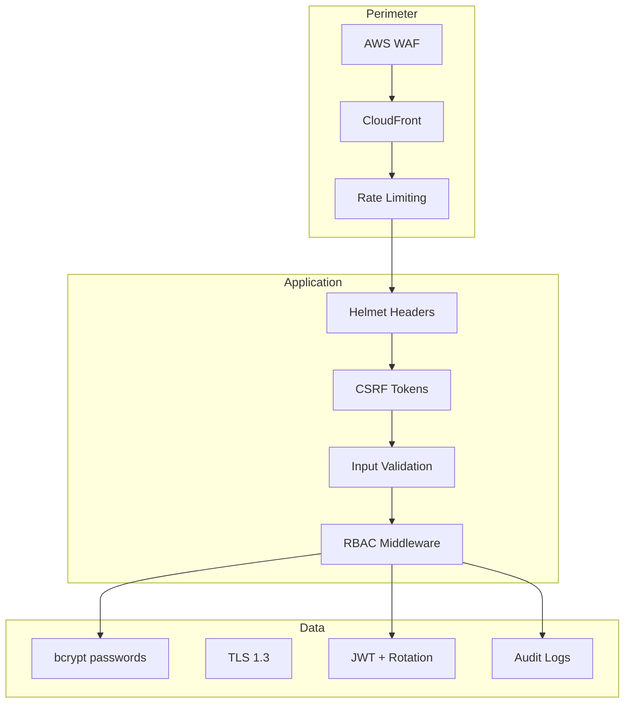

# Security Architecture

---

## 1. Security Layers



---

## 2. Authentication Design

| Mechanism | Implementation |
|-----------|----------------|
| Password storage | bcrypt, cost factor 12 |
| Access token | JWT RS256, 15 min TTL, claims: sub, role, permissions, jti |
| Refresh token | Opaque or JWT, HttpOnly Secure SameSite=Strict cookie |
| Rotation | New refresh on each use; reuse detection revokes entire family |
| MFA | TOTP (speakeasy), backup codes hashed |
| OAuth | PKCE flow, state param, email must match for link |
| Session revoke | Redis set `blocklist:{jti}` TTL = access token remaining |

---

## 3. Authorization (RBAC)

**Permission check flow:**
1. Extract JWT → validate signature + expiry + blocklist
2. Load user status (reject if `suspended`)
3. Match route permission: `authorize('application:update:company')`
4. Scope check: resource `companyId` === user `companyId`

**Admin bypass:** explicit `admin:*` permission only on `/admin/*` routes.

---

## 4. OWASP Mitigations

| Threat | Mitigation |
|--------|------------|
| Injection | Mongoose parameterized queries; Joi validation; no `$where` user input |
| XSS | React escaping; CSP via Helmet; sanitize HTML in rich text (DOMPurify) |
| CSRF | Double-submit cookie or SameSite=Strict + CSRF token for state-changing cookie auth |
| Broken Auth | Short TTL, rotation, lockout, MFA |
| Sensitive Data Exposure | TLS everywhere; no PII in logs; field-level redaction |
| Security Misconfiguration | Helmet, disable x-powered-by, env secrets in AWS Secrets Manager |
| IDOR | Ownership checks in service layer on every mutation |

---

## 5. Helmet Configuration

```javascript
helmet({
  contentSecurityPolicy: { directives: { defaultSrc: ["'self'"], ... } },
  hsts: { maxAge: 31536000, includeSubDomains: true },
  frameguard: { action: 'deny' },
  noSniff: true,
  referrerPolicy: { policy: 'strict-origin-when-cross-origin' }
});
```

---

## 6. Rate Limiting & Brute Force

- **Redis sliding window** per IP + per account on `/auth/login`
- 5 failures → `lockUntil` +15 min on user document
- CAPTCHA after 3 failures (Phase 2)
- Distributed rate limit via Redis for multi-pod K8s

---

## 7. File Upload Security

1. Presigned PUT with content-type whitelist (`application/pdf`, etc.)
2. Max size enforced at S3 policy + API
3. Async ClamAV scan; object quarantined until clean
4. Serve files via CloudFront signed URLs, not public buckets

---

## 8. Secrets Management

- **Never** commit `.env`
- AWS Secrets Manager → External Secrets Operator → K8s secrets
- JWT keys rotated quarterly; support overlapping `kid` in JWKS endpoint

---

## 9. Audit & Compliance

- All admin actions → `audit_logs`
- Data export API (GDPR Article 15)
- Account deletion: soft delete + anonymize PII after 30-day grace
- SOC2-ready: access logs retained 1 year

---

## 10. Security Testing

| Test | Frequency |
|------|-----------|
| `npm audit` | Every CI build |
| OWASP ZAP baseline | Weekly on staging |
| Penetration test | Annual |
| Dependency update | Dependabot weekly |
