# DevOps & Cloud Architecture

---

## 1. AWS Service Map

| Service | Purpose |
|---------|---------|
| **Route 53** | DNS `internshipplatform.com` |
| **CloudFront** | SPA + static assets CDN |
| **S3** | Frontend build, resumes, submissions, certificates |
| **ALB** | Load balance API pods |
| **EKS** | Kubernetes cluster (or ECS Fargate alternative) |
| **EC2** | Node groups for EKS workers |
| **Secrets Manager** | DB URI, JWT keys, API keys |
| **SES** | Transactional email |
| **SNS** | SMS notifications |
| **WAF** | OWASP rule sets, geo block optional |
| **MongoDB Atlas** | Managed MongoDB (M10+ sharded) |
| **Redis Cloud** | Cache, sessions, queues |

---

## 2. CI/CD Pipeline

```mermaid
flowchart LR
    subgraph Trigger
        PR[Pull Request]
        MAIN[Push to main]
    end

    subgraph CI
        LINT[Lint + Typecheck]
        UNIT[Unit Tests]
        INT[Integration Tests]
        BUILD[Docker Build]
        SCAN[Trivy Scan]
        PUSH[Push to ECR]
    end

    subgraph CD_Staging
        DEPLOY_S[Deploy to Staging EKS]
        SMOKE[Smoke Tests]
        E2E[Playwright E2E]
    end

    subgraph CD_Production
        APPROVE[Manual Approval]
        DEPLOY_P[Blue/Green Deploy]
        CANARY[Canary 10% → 100%]
        MON[Monitor 15min]
    end

    PR --> LINT --> UNIT --> INT
    MAIN --> LINT --> UNIT --> INT --> BUILD --> SCAN --> PUSH
    PUSH --> DEPLOY_S --> SMOKE --> E2E
    E2E --> APPROVE --> DEPLOY_P --> CANARY --> MON
```



---

## 3. GitHub Actions Workflow (Summary)

**`.github/workflows/ci.yml`**
- Triggers: `pull_request`, `push` to `main`
- Jobs: `lint`, `test-backend`, `test-frontend`, `build-images`
- Cache: npm, Docker layers

**`.github/workflows/deploy-staging.yml`**
- On merge to `main`
- `kubectl apply -k overlays/staging`
- Run Newman/Postman collection against staging

**`.github/workflows/deploy-prod.yml`**
- Manual `workflow_dispatch` or tag `v*`
- Blue/green via Argo Rollouts or Flagger

---

## 4. Docker

**API Dockerfile (multi-stage):**
```dockerfile
FROM node:20-alpine AS builder
WORKDIR /app
COPY package*.json ./
RUN npm ci --only=production
COPY . .
FROM node:20-alpine
WORKDIR /app
COPY --from=builder /app .
USER node
EXPOSE 3000
HEALTHCHECK CMD wget -qO- http://localhost:3000/health || exit 1
CMD ["node", "src/server.js"]
```

---

## 5. Kubernetes Manifests (Kustomize)

```
k8s/
├── base/
│   ├── deployment-api.yaml      # replicas: 2, resources, probes
│   ├── deployment-worker.yaml
│   ├── service-api.yaml
│   ├── ingress.yaml
│   ├── hpa-api.yaml             # min 2, max 20, CPU 70%
│   └── configmap.yaml
└── overlays/
    ├── staging/
    └── production/
```

**Probes:**
- Liveness: `GET /health`
- Readiness: `GET /health/ready` (Mongo + Redis)

**NGINX Ingress:**
- TLS cert via cert-manager + Let's Encrypt
- `client_max_body_size 10m`
- Rate limit annotations

---

## 6. Deployment Workflow

1. Merge PR → CI green → image tagged `sha-abc123`
2. Staging deploy auto → smoke + E2E
3. QA sign-off → production workflow
4. Blue deployment receives 0% traffic initially
5. Canary: 10% for 5 min → 50% → 100%
6. Old (green) kept 1h for instant rollback

---

## 7. Rollback Strategy

| Scenario | Action |
|----------|--------|
| Bad deploy detected in canary | Auto-rollback via Flagger (prometheus error rate > 1%) |
| Post-full deploy issue | `kubectl rollout undo deployment/api` |
| DB migration failure | Run `down` migration script; restore PITR if destructive |
| Config error | Revert Git commit + redeploy previous image tag |

**RTO:** 15 minutes | **RPO:** 5 minutes (Atlas PITR)

---

## 8. Environment Strategy

| Env | Purpose | Data |
|-----|---------|------|
| local | Dev | Docker Compose Mongo + Redis |
| staging | Pre-prod | Anonymized seed data |
| production | Live | Real |

---

## 9. Observability Stack

| Concern | Tool |
|---------|------|
| Logs | CloudWatch Logs → optional Datadog |
| Metrics | Prometheus + Grafana (or CloudWatch Container Insights) |
| Traces | AWS X-Ray / OpenTelemetry |
| Alerts | PagerDuty on: 5xx rate > 1%, latency P95 > 1s, pod restarts |
| Uptime | Route 53 health checks + external Pingdom |

---

## 10. Backup Runbook

- MongoDB Atlas: continuous backup, test restore monthly
- S3: versioning enabled, lifecycle to Glacier after 90d
- Redis: RDB snapshots daily (non-critical cache rebuildable)
